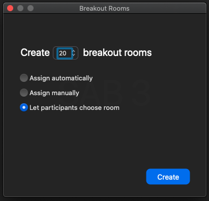
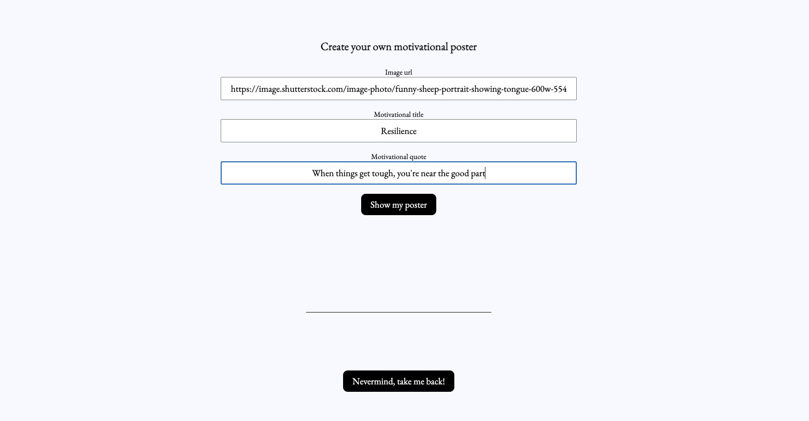
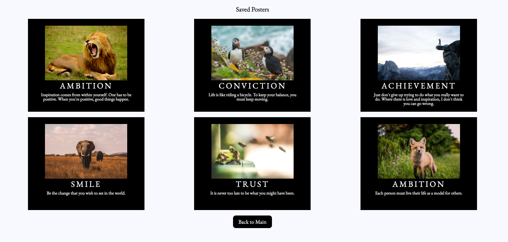
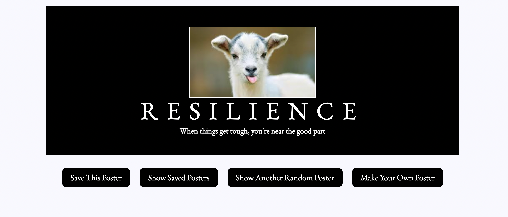

# Hang In There

#### A Project for Motivation and Compassion

  *Work on this project has slowed or stopped completely. Deadline 2/15/2021, 12pm MST.*

## Learning Goals

* Gain understanding of how to write clean, *DRY* `JavaScript`, and SRP for manipulating data
* Use provided class by creating object instances, using the new keyword
* Manipulate `HTML` with `JavaScript` after the page has loaded, adding, removing, and updating elements on the `DOM`
* Begin to understand the connection between HTML, CSS, and JavaScript
* Begin to understand how to refactor, debug and review a project to fully understand each piece of style and function

Project spec & rubric can be found [here](https://frontend.turing.io/projects/module-1/hang-in-there.html)

## Overview

  * This is a paired and student project to help foster the understanding of the nuances of working closely with another person while building and solidifying logic.  We were tasked to build an application that allows the user save, create and randomly generate a motivational poster.  

## Set-up

  * Have one partner fork the repository found here: https://github.com/turingschool-examples/hang-in-there-boilerplate/
  * Clone to local
  * `cd` into the repository
  * Open in text editor
  * Read the boiler plate README.md
  * Add all project partners and pm as collaborators
  * In terminal, run command "open index.html" to interact with app.

## Project Links

  * [Repo](https://github.com/battan40/hang-in-there-boilerplate)
  * [Deployed Page](https://battan40.github.io/hang-in-there-boilerplate/)

## Contributors

  * [Kendall Haworth](https://github.com/kendallha)
  * [Angela Battillo](https://github.com/battan40)

## Functionality Goals

  * At full functionality a user can randomly generate posters with titles, images, and catch-phrases. Users can also create and save their own posters from the randomly generated posters, as well as from imported images.

## Road Map

  * Future iterations should include implementation of data validation and error handling into the form
  * Allow the main poster view listens for a click to change image, title or quote and then updates the main page
  * When a user single clicks a saved poster, they can then view it as larger
  * Allow users to drag and drop saved posters into whatever order they want them to appear

## Preview

Main Page 
 

Input Form 
 

Saved Poster 
 

Show Me My Poster -- User Creation 
 

